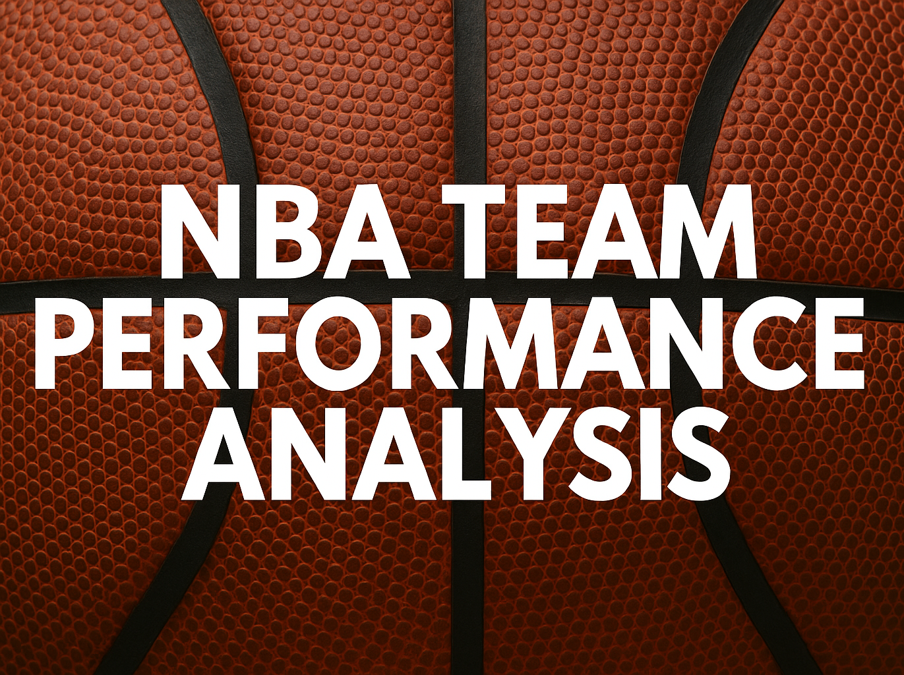

🏀 NBA Team Performance Analysis



# 🔧 Tech Stack  
<p align="left">
  
  
  
  
  
  
</p>

📚 Table of Contents

Executive Summary

Project Highlights

1. Project Overview

2. Business Questions

3. Methodology

4. Results & Visualizations

5. Key Takeaways

6. Next Steps

Folder Structure

Contact

🧠 Executive Summary

This project delivers a comprehensive, data-driven evaluation of historical NBA franchise performance using SQL, Python, and professional visualization techniques. The objective is to uncover both short-term and long-term patterns by analyzing regular-season results, win/loss trends, year-over-year improvements, and multi-season dominance windows.

Advanced data transformations were performed in SQL, and Python (pandas + Matplotlib) was used to generate polished visualizations. The project also includes a focused deep dive into the Los Angeles Lakers’ strongest five-year run.

Together, these components demonstrate strong skills in data cleaning, analytical reasoning, visualization design, and technical documentation—making this project well-suited for analytics portfolios and hiring assessments.

🌟 Project Highlights

- Analyzed multiple decades of NBA team performance across wins, losses, and win%.

- Identified the strongest single-season and five-year dominance windows.

- Highlighted the largest year-to-year win improvements across all teams.

- Created six polished visualizations in Matplotlib.

- Built an end-to-end pipeline from SQL → Python → GitHub documentation.

- Performed a case study on the Lakers’ most dominant 5-year stretch.

🔹 1. Project Overview

This project analyzes long-term NBA franchise performance using cleaned team-level season data. The focus is on uncovering historical trends such as dominant eras, rebuilding periods, major improvements, and team consistency across decades.

🔹 2. Business Questions

This project investigates the following questions:

- Which teams recorded the best and worst regular seasons in NBA history?

- Which teams showed the largest single-season jump in wins?

- Which franchises had the strongest five-year stretches?

- How do NBA teams compare in all-time wins, losses, and win percentage?

- What was the best five-year run in Lakers history, and how did each season contribute?

🔹 3. Methodology
Tools Used

- SQL (Oracle SQL Developer) – data cleaning, filtering, and multi-season calculations

- Python (pandas, matplotlib) – analysis and visualizations

- Git/GitHub – version control and documentation

Steps

1. Loaded and cleaned historical team data (wins, losses, win percentages).

2. Created SQL queries to aggregate season results and five-year rolling windows.

3. Identified top and bottom performance seasons, YOY changes, and franchise patterns.

4. Built visualizations highlighting major insights.

🔹 4. Results & Visualizations

## 🏆 Best Regular Season Records (Top 5)
**Insight:** 
Teams with historically high win percentages often represent dynasty-level rosters or highly efficient coaching systems.


---

## 📉 Worst Regular Season Records (Top 5)
**Insight:** 
These seasons often align with rebuilding phases, roster injuries, or transitions between star eras.


---

## 🔺 Largest Win Increase (Two Seasons Compared)
**Insight:** 
Massive win jumps commonly coincide with acquiring superstar players, hiring elite coaching staffs, or recovering from injury-heavy years.


---

## 📊 Top 5 Records Over a Five-Year Span
**Insight:** 
Five-year dominance often reflects sustained coaching stability and strong roster cores. Comparing wins vs. losses over these windows highlights overall organizational efficiency.


---

## 📊 Leaguewide Wins & Losses (Sorted by All-Time Win Percentage)
**Insight:** 
Sorting by win% highlights long-term consistency rather than total games played. Historic powerhouses like the Lakers, Celtics, and Spurs rank near the top, while younger franchises or long-rebuilding teams fall lower.


---

## 🟣🟨 Lakers’ Best 5-Year Run — Season-by-Season Breakdown
**Insight:** 
This isolates the single most dominant stretch in Lakers history and provides a deeper look into how each season contributed to the peak.


---

🔹 5. Key Takeaways

- Consistent excellence is visible among franchises like the Lakers, Celtics, and Spurs.

- Large single-season improvements often align with roster or coaching changes.

- Five-year spans reveal teams that dominated extended periods, not just one great season.

- Win percentage gives a more accurate measure of long-term success than raw win totals.

- The Lakers’ strongest five-year run showcases exceptional seasonal consistency.

🔹 6. Next Steps

- Add playoff and championship data for deeper franchise comparisons.

- Integrate advanced analytics (SRS, net rating, BPM, RAPTOR).

- Build an interactive dashboard (Tableau, Power BI, Streamlit).

- Compare historical eras and rivalry matchups.

- Introduce player-level impact metrics.

## 📁 Folder Structure
```

NBA-Analysis/
│
├── Data/
│     ├── common_player_info.csv
│     ├── draft_combine_stats.csv
│     ├── draft_history.csv
│     ├── game.csv
│     ├── game_info.csv
│     ├── game_summary.csv
│     ├── inactive_players.csv
│     ├── line_score.csv
│     ├── officials.csv
│     ├── other_stats.csv
│     ├── player.csv
│     ├── team.csv
│     ├── team_details.csv
│     ├── team_history.csv
│     ├── team_info_common.csv
│     ├── .gitignore
│
├── Images/
│     ├── banner.png
│     ├── best_regular_season_records.png
│     ├── worst_regular_season_records.png
│     ├── largest_win_increase_two_seasons_comparison_with_years.png
│     ├── top_records_over_five_year_span_side_by_side.png
│     ├── nba_total_wins_losses_sorted_by_winpct_red_palette.png
│     ├── lakers_best_5_year_span_season_breakdown_fixed.png
│
├── sql/
│
└── README.md
```


📫 Contact

GitHub: https://github.com/michaelmilovanovski

LinkedIn: https://www.linkedin.com/in/michael-milovanovski-991867396/

Email: michaeld.milovanovski@gmail.com